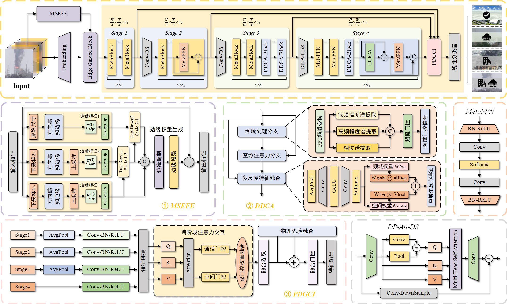

# 双域边缘调制与物理先验的实时雾天烟雾检测
# Real-time Smoke Detection in Foggy Conditions via Dual-Domain Edge Modulation and Physical Priors


This is the code for the paper [Real-time Smoke Detection in Foggy Conditions via Dual-Domain Edge Modulation and Physical Priors]

### 摘要
针对雾天环境下烟雾与雾在视觉特征上高度相似导致检测准确率下降的问题，提出一种双域边缘调制结合物理先验的雾天烟雾检测方法。该方法通过多尺度边缘感知特征增强模块捕获多方向边缘信息并建模烟雾模糊边界；提出动态双域协同注意力机制实现频域与空域特征的判别增强；设计结合物理先验的双门控跨阶段集成模块通过跨阶段融合结合物理先验适配多尺度烟雾特征。构建了目前最大的雾中烟雾检测数据集SFDD，并在SFDD和UIW数据集上进行验证。实验结果表明，该方法在SFDD数据集上准确率达94.64%，在UIW数据集上达99.70%，保持轻量化的同时均优于现有方法。经ONNX优化后在CPU和GPU上推理速度分别达104.83 FPS和221.72 FPS，满足实时检测需求，为雾天环境下的火烟预警提供高效解决方案。

### Abstract
To address decreased detection accuracy caused by high visual similarity between smoke and fog in foggy environments, a smoke detection method combining dual-domain edge modulation with physical priors is proposed. The method captures multi-directional edge information and models fuzzy smoke boundaries through a multi-scale edge-aware feature enhancement module. A dynamic dual-domain collaborative attention mechanism achieves discriminative enhancement of frequency-domain and spatial-domain features. A dual-gated cross-stage integration module incorporating physical priors adapts multi-scale smoke features through cross-stage fusion. The currently largest smoke detection dataset in fog, SFDD, was constructed and validated on SFDD and UIW datasets. Experimental results show the method achieves 94.64% accuracy on SFDD and 99.70% on UIW, outperforming existing methods while maintaining lightweight characteristics. After ONNX optimization, inference speeds reach 104.83 FPS on CPU and 221.72 FPS on GPU, meeting real-time detection and providing an efficient solution for fire-smoke warning in foggy environments.



## Requirements
This project heavily builds on [timm](https://github.com/huggingface/pytorch-image-models) and open source implementations of the models that are tested.
All requirements are listed in [requirements.txt](./requirements.txt).
To install those, run
```commandline
pip install -r requirements.txt
```

## Key Innovations
 
- **MSEFE**: Multi-Scale Edge-Aware Feature Enhancement module — learnable four-direction gradient detectors with pyramid fusion for modeling fuzzy smoke boundaries.
- **DDCA**: Dynamic Dual-Domain Collaborative Attention — FFT-based frequency-domain gating to collaboratively modulate spatial attention weights.
- **PDGCI**: Dual-Gated Cross-Stage Integration with Physics Prior — cross-stage attention with channel/spatial dual gating and smoke physical priors (transparency, diffusion, color consistency).
- **SFDD Dataset**: The largest fog-smoke detection dataset, containing 32,662 images across industrial, forest, urban and other real-world scenes.
 
---
 
## Requirements
 
```
pip install -r requirements.txt
```
 
---
 
## Dataset Preparation
 
**SFDD** (constructed in this work): 32,662 images divided into four categories — normal scene, fire-smoke scene, haze scene, and smoke-in-fog coexistence. Split ratio 8:1:1.
 
**UIW**: A large-scale wildfire UAV image dataset containing 49,452 images. Available at [EdgeFireSmoke](https://github.com/.../).
 
Place datasets in the following structure:
 
```
data/
├── SFDD/
│   ├── train/
│   ├── val/
│   └── test/
└── UIW/
    ├── train/
    ├── val/
    └── test/
```

---
 
## Results
 
| Method | SFDD Acc (%) | UIW Acc (%) | Params (M) | GFLOPs | CPU FPS | GPU FPS |
|:---|:---:|:---:|:---:|:---:|:---:|:---:|
| FireNet | 80.69 | 87.22 | 88.16 | 0.22 | 65.55 | 178.03 |
| DeepSmoke | 94.00 | 99.17 | 30.39 | 2.45 | 25.64 | 56.62 |
| EfficientFormer | 93.87 | 98.57 | 25.92 | 2.59 | 24.21 | 71.74 |
| **DEPformer (ours)** | **94.64** | **99.70** | **6.62** | **0.88** | **104.83** | **221.72** |
 
CPU: Intel i7-8700 &nbsp;&nbsp; GPU: NVIDIA RTX 3090
 

## License
 
This project is released under the [MIT License](./LICENSE).
```
